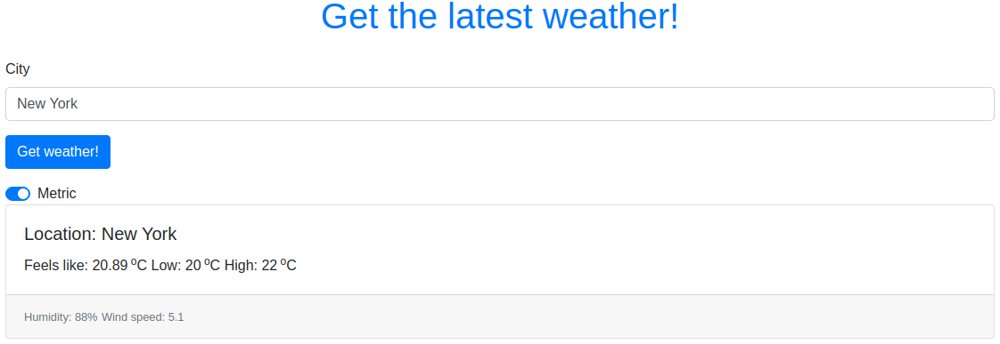

# JavaScript Weather App - Working with APIs

> Display weather data for your location using JavaScript.

This app was built with JavaScript and Bootstrap. Allow your location in Browser to get weather updates without searching!

## Built With

- JavaScript
- WebPack
- Openweathermap API
- Bootstrap for styling

## Live Demo

[Live Demo Link](https://rawcdn.githack.com/Azeem838/weather-app/38cd3fd21d04c9c4d1bb70a69ee1c5754e20b30f/dist/index.html)

## Getting Started

To get a local copy up and running follow these simple example steps.

### Prerequisites

Have a browser installed

### Setup

Clone this repo with <code>git clone git@github.com:Azeem838/weather-app.git</code>

### Usage

1. <code>cd</code> into the project directory
2. run <code>npm install</code>
3. Open index.html in the dist/ folder in a browser and enjoy :smiley:

## Authors

:bust_in_silhouette: **Azeem Ahmed**

- Github: [@Azeem838](https://github.com/Azeem838)
- LinkedIn: [Azeem Ahmed](www.linkedin.com/in/azeemmahmed)

## 🤝 Contributing

Contributions, issues and feature requests are welcome!

Feel free to check the [issues page](https://github.com/Azeem838/restaurant-page/issues).

## Show your support

Give a ⭐️ if you like this project!

## Acknowledgments

- Hat tip to anyone whose code was used
- Inspiration
- etc

## 📝 License

This project is [MIT](lic.url) licensed.
